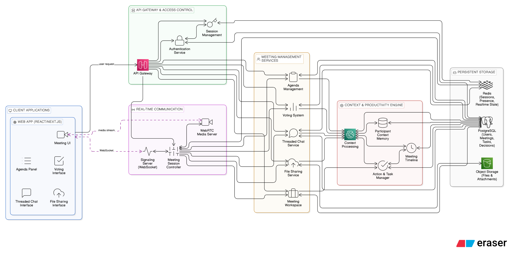
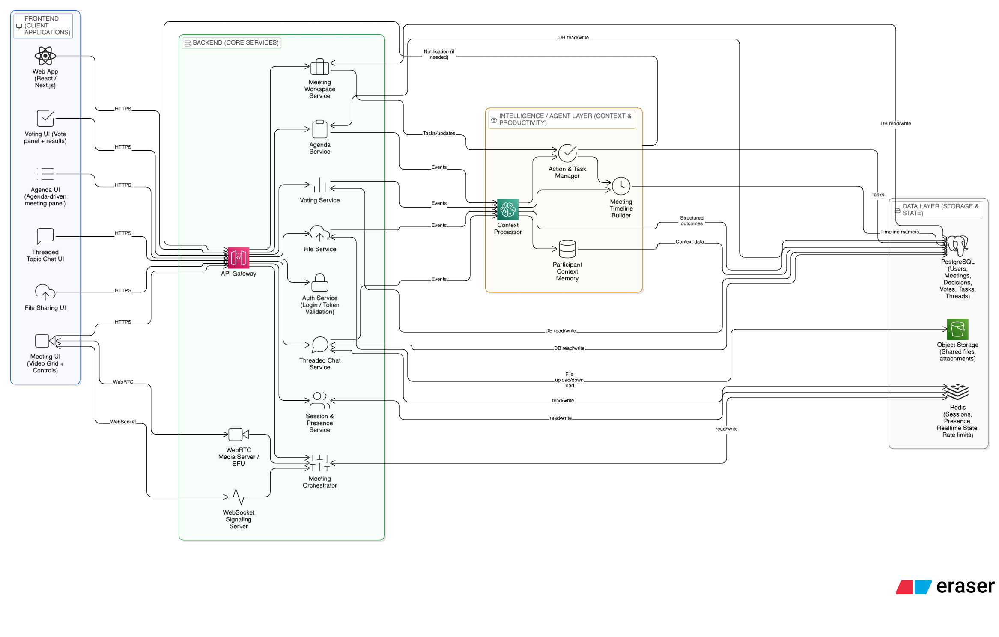

# RealMeet

RealMeet is a real-time meeting and collaboration system designed to provide a secure, fast, and reliable environment for modern communication. The platform focuses on building an intelligent, context-aware, and productivity-driven meeting experience rather than a generic video-calling tool.

RealMeet combines real-time communication, contextual intelligence, structured collaboration workflows, and productivity-oriented meeting tools to create a next-generation meeting system.

---

## Vision

The vision of RealMeet is to transform meetings from passive communication sessions into intelligent, assistive, and continuity-driven collaborative experiences.

Instead of simply connecting participants, the system aims to:

- Understand meeting context  
- Capture important decisions  
- Assist users with follow-up actions  
- Reduce cognitive load during discussions  
- Enable structured and outcome-focused meetings  

---

## Motivation

Most mainstream video-calling platforms provide generic features targeted at mass users. These platforms often lack contextual awareness and do not retain meaningful interaction history across meetings.

As a result:

- Discussions are frequently repeated  
- Decisions are forgotten  
- Tasks are not clearly tracked  
- Collaboration continuity is weak  
- Meetings often drift without structure  

RealMeet was created to address these limitations by introducing a meeting system that focuses on context, memory, structured collaboration, and clear decision tracking.

---

## Core Features

### Secure Communication

RealMeet prioritizes secure communication to protect conversations and shared information between participants.

### High Performance & Reliability

The system is designed for low latency and stable connections, ensuring smooth real-time interactions even under varying network conditions.

### Agent-Assisted Meeting Support

Built-in intelligent assistance helps users manage meetings by:

- Tracking discussions  
- Providing contextual prompts  
- Supporting meeting flow  

### Context-Aware Intelligence

RealMeet adapts based on meeting context and participant interactions to improve communication clarity and awareness.

---

## Structured Meeting Management

### Agenda-Driven Meeting Mode

RealMeet allows organizers to define and manage a structured meeting agenda.

**Capabilities**

- Create discussion topics before the meeting  
- Assign time allocation per topic  
- Track the currently active agenda item  
- Maintain controlled meeting flow  

**Outcome**

Meetings remain focused, time-efficient, and less prone to topic drift.

---

### Integrated Voting System

RealMeet includes a built-in voting mechanism for transparent group decision-making.

**Capabilities**

- Quick yes/no or multi-option voting  
- Live result visibility  
- Decision confirmation within the meeting  

**Outcome**

Decisions are clearly recorded, reducing ambiguity after meetings.

---

### Threaded Topic Chat

Chat conversations are organized based on discussion topics rather than a single continuous stream.

**Capabilities**

- Separate chat threads per agenda item  
- Context-specific discussions  
- Easy post-meeting review  

**Outcome**

Prevents message clutter and preserves discussion clarity.

---

## Context-Aware Face Recognition

RealMeet includes an automatic recognition and contextual awareness system that identifies participants and surfaces relevant information.

During a meeting, the system can display contextual details related to participants, helping users quickly understand who is speaking and recall previous interactions.

### Benefits

- Reduces manual identification  
- Improves participant awareness  
- Maintains continuity between meetings  

---

## Automated Action & Task Intelligence

RealMeet detects actionable statements during meetings and converts them into structured tasks.

### Automatic Action Detection

If participants mention commitments such as:

- “I will complete this in 2 days”  
- “Let’s meet tomorrow morning”  
- “We should review this next week”  

The system extracts these intents and generates corresponding actions.

### Smart Scheduling

Detected actions can be:

- Converted into calendar events  
- Scheduled with deadlines  
- Linked to meeting context  

### Intelligent Task Organization

Tasks are:

- Categorized by importance  
- Grouped by meeting  
- Assigned to responsible participants  

### Priority-Based Management

The system highlights:

- High-priority commitments  
- Upcoming deadlines  
- Non-urgent reminders  

This ensures users leave meetings with a clear understanding of responsibilities.

---

## Advanced Intelligent Capabilities

### Smart Participant Memory

RealMeet maintains contextual memory across meetings and surfaces previously discussed topics when participants rejoin.

### Real-Time Meeting Insight Layer

The system detects:

- Active speakers  
- Key discussion moments  
- Important statements  

### Intelligent Meeting Timeline

Meetings are automatically structured into:

- Topic transitions  
- Decision points  
- Key discussion segments  

### Context-Linked Notes

Notes are linked with:

- Speaker  
- Timestamp  
- Discussion context  

### Adaptive Meeting Experience

The interface adapts based on collaboration patterns and participant behavior.

---

## Collaboration & Communication Features

### Real-Time Chat

Participants can exchange messages during meetings for:

- Quick clarifications  
- Links and references  
- Silent communication  

### Distributed File Sharing

RealMeet supports secure file sharing during meetings.

**Capabilities**

- Share documents in real time  
- Attach files to meeting context  
- Maintain shared resource history  

### Persistent Meeting Workspace

Each meeting maintains a shared workspace that stores:

- Files  
- Notes  
- Decisions  
- Tasks  

This ensures continuity across sessions.

---

## System Design Overview

RealMeet is designed as a distributed real-time communication system that integrates multiple subsystems:

### Real-Time Communication Layer

- Handles video and audio streaming  
- Maintains low-latency connections  
- Manages participant sessions  

### Context Processing Layer

- Tracks meeting interactions  
- Extracts contextual signals  
- Maintains meeting memory  

### Intelligence & Agent Layer

- Detects action items  
- Generates tasks  
- Provides contextual assistance  

### Collaboration Layer

- Agenda management  
- Voting system  
- Threaded discussions  
- Chat and file sharing  

### Data Persistence Layer

- Stores users  
- Meeting history  
- Decisions and tasks  
- Contextual metadata  

---

## Distributed System Characteristics

RealMeet follows distributed system principles to ensure scalability and reliability:

- Independent service components  
- Real-time event-driven communication  
- Session-based participant management  
- Persistent state storage  
- Fault-tolerant meeting continuity  

This architecture allows the system to support multiple concurrent meetings efficiently.

---

## Project Background

RealMeet started as a semester project aimed at building an innovative real-time meeting platform that goes beyond traditional video-calling systems.

The objective was to explore how intelligent assistance, contextual awareness, and structured collaboration tools can improve the effectiveness of meetings.

---

## Expected Impact

RealMeet represents a shift toward structured and intelligent collaboration environments where meeting platforms:

- Preserve context  
- Record decisions clearly  
- Support organized discussions  
- Improve long-term team productivity  

The project serves as a foundation for future development in context-aware and productivity-driven real-time communication systems.

## Architecture

# RealMeet (Web-Based) — Complete Tech Stack & Components

## 1. Frontend (Web App)

- **Framework:** Next.js (App Router)  
- **Language:** TypeScript  
- **UI:** Tailwind CSS + shadcn/ui  
- **Icons:** lucide-react  
- **State Management:** Zustand  
- **Data Fetching:** TanStack Query (React Query)  
- **Forms:** React Hook Form  
- **Validation:** Zod  
- **Media UI:** Custom components (video grid, controls)  
- **Notifications:** Sonner (or React Hot Toast)

---

## 2. Realtime + Meetings

- **Realtime Transport:** Socket.io (WebSocket)  
- **Video & Audio:** Native WebRTC APIs (RTCPeerConnection, MediaDevices)  
- **Signaling:** Socket.io signaling events  
- **Presence:** Socket.io rooms + heartbeat/ping  
- **TURN/STUN:** Coturn (TURN) + Google STUN (development)

---

## 3. Backend (Core API)

- **Runtime:** Node.js  
- **Language:** TypeScript  
- **Framework:** Express.js (separate server) OR Next.js API routes (MVP)  
- **Realtime Server:** Socket.io server attached to Node/Express  
- **Auth Middleware:** Clerk server SDK (or JWT middleware if custom)  
- **Input Validation:** Zod (shared schemas)

---
<!-- sd -->
## 4. Database + Storage

- **Primary Database:** PostgreSQL  
- **ORM:** Prisma  
- **Cache / Realtime State:** Redis  
- **Background Jobs:** BullMQ (Redis-backed queue)  
- **File Storage:** AWS S3 (or Supabase Storage for MVP)  
- **File Upload Handling:** Presigned URLs (S3) + metadata in Postgres

---

## 5. Authentication + Authorization

- **Auth Provider:** Clerk  
- **Route Protection:** Middleware (Next.js) + server-side auth checks  
- **Authorization:** Role-based rules (owner, moderator, participant)

---

## 6. Core Product Modules (Features)

### A. Meeting & Rooms
- Meeting Room Creation + Join by Code  
- Participant list + roles  
- Host controls (mute all, remove, lock room)

### B. Agenda-Driven Meetings (No Heavy AI)
- Agenda CRUD (create/edit/reorder topics)  
- Topic timer (optional)  
- Active topic state broadcast via Socket.io

### C. Voting System (No Heavy AI)
- Vote creation (Yes/No or options)  
- Live vote updates via Socket.io  
- Vote results stored in Postgres (auditable)

### D. Threaded Topic Chat (No Heavy AI)
- Chat threads per agenda topic  
- Messages stored in Postgres  
- Live delivery via Socket.io  
- Pin important messages (optional)

### E. File Sharing (Distributed Collaboration Feature)
- Upload file → S3  
- Share link + permissions in meeting workspace  
- Attach files to specific agenda topic/thread

### F. Meeting Workspace (Persistence)
- Meeting summary objects (manual)  
- Decisions log (manual + voting output)  
- Tasks list (manual + assisted creation)  
- Files + links repository

---

## 7. Speech + Actions (Optional but Strong)

### A. Speech-to-Text (Choose One)
- **MVP (Browser):** Web Speech API (SpeechRecognition) → live transcript  
- **Production:** OpenAI Whisper API OR Google Speech-to-Text (server)

### B. Text-to-Speech
- Browser TTS: SpeechSynthesis API  
- Use cases: reminders, agenda changes, vote prompts

### C. Action Detection (Human-in-the-Loop, Not AI-Dependent)
- Rules/Patterns: Regex + date parsing + assignee tagging  
- Date Parsing: chrono-node (or date-fns + custom)  
- Confirmation UI: “Create Task / Schedule Event” cards  
- Task Storage: Postgres  
- Calendar Sync: Google Calendar API (optional)

---

## 8. Light Intelligence Layer (Optional, Non-Blocking)

- Goal: Enhance formatting and organization, not core meeting function  
- Implementation: Node endpoint + async job  
- Queue: BullMQ  
- Storage: Postgres (store outputs)  
- LLM (optional): OpenAI API for summary formatting or timeline suggestions  
  - Run on demand or post-meeting  
  - Never inside realtime loop

---

## 9. Deployment (Simple & Professional)

- **Frontend Hosting:** Vercel  
- **Backend Hosting:** Railway / Render  
- **PostgreSQL:** Neon / Supabase / Railway Postgres  
- **Redis:** Upstash Redis  
- **TURN Server:** VPS (Ubuntu) running coturn (optional for NAT traversal)  
- **Storage:** AWS S3

---

## 10. Development & Quality

- **API Docs:** OpenAPI / Swagger (optional)  
- **Logging:** pino (backend)  
- **Error Tracking:** Sentry (optional)  
- **Code Quality:** ESLint + Prettier  
- **Git Hooks:** Husky + lint-staged (optional)

---

## Summary (One-Line Stack)

**Next.js + TypeScript + Tailwind + shadcn/ui + WebRTC + Socket.io + Node/Express + PostgreSQL/Prisma + Redis/BullMQ + S3 + Clerk (+ optional STT/TTS + Calendar sync)**
# realmeet-app
